# Locus

pitch deck : [LINK](https://docs.google.com/presentation/d/1GME8JNXbEJsT5j5TEH5E5DR62vINkOrU/edit?usp=sharing&ouid=106613689610271939981&rtpof=true&sd=true)

**submission for guidewire devtrails 2026**

**Parametric Income Protection for India's Gig Delivery Workers**

> When it rains on a thursday evening in chennai, a zepto partner does not just lose one order. they lose their peak slot, their weekly incentive slab, and sometimes the ability to cover rent that week. the platform charges the customer a rain surcharge. the worker absorbs the loss entirely. locus is built to fix that specific injustice.

---

## the problem

fifteen lakh delivery workers run this country's quick commerce economy. they work without contracts, without employer benefits, and without any income protection that understands how they actually earn money.

when a disruption hits — rain, a curfew, flooding, a local bandh — they lose income they cannot recover. not because they made a bad decision. because the sky had a bad day.

traditional insurance was not built for this. it assumes monthly salaries, tax documents, and bank statements. the gig worker has none of these things. what they have is a phone, a weekly payout, and a disruption that does not wait.

zomato and swiggy have both acknowledged rain costs workers money — they charge customers a surcharge for it. that money does not reach the worker in any reliable form. it gets absorbed elsewhere.

locus closes that gap.

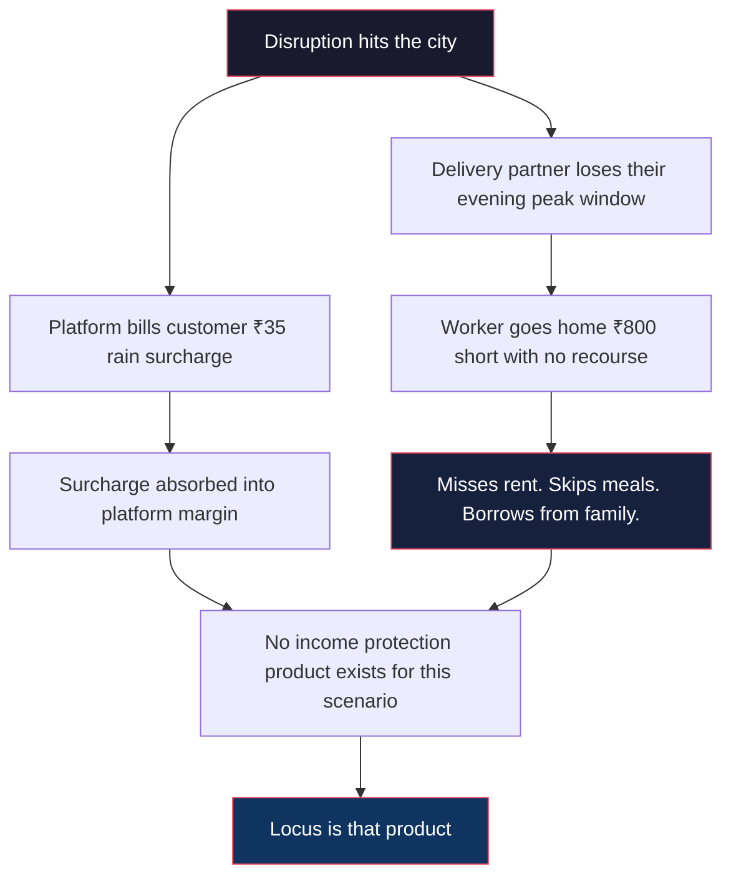

---

## what locus does

locus is a parametric income protection platform with an embedded credit facility. when an external disruption crosses a threshold in a worker's active zone, locus detects it and initiates a payout or credit advance automatically. no action required from the worker.

no claim forms. no documents. no waiting. the money arrives before they think to ask for it.

the product operates on two layers depending on severity. severe events like declared floods or citywide curfews trigger a direct payout between ₹500 and ₹1000 with no repayment. moderate events like heavy rain or local strikes trigger a credit advance between ₹200 and ₹500, repaid gradually through future earnings at ₹50 to ₹100 per week. consistent repayment over six months builds a formal credit history — something most gig workers do not have anywhere in the financial system today.

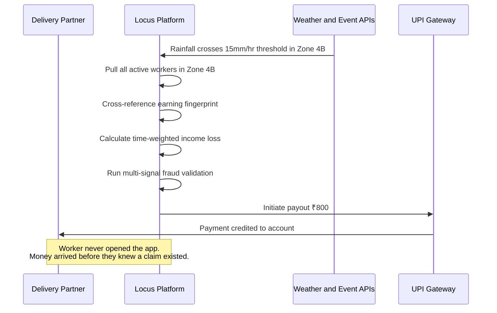

---

## persona

**Grocery and Quick-Commerce Delivery Partners**
zepto, blinkit, swiggy instamart

this segment runs on ten-minute delivery windows. it is the most weather-sensitive delivery category in india. workers are concentrated in dense urban pincodes which makes hyperlocal risk modeling viable in a way that city-level weather data simply cannot support.

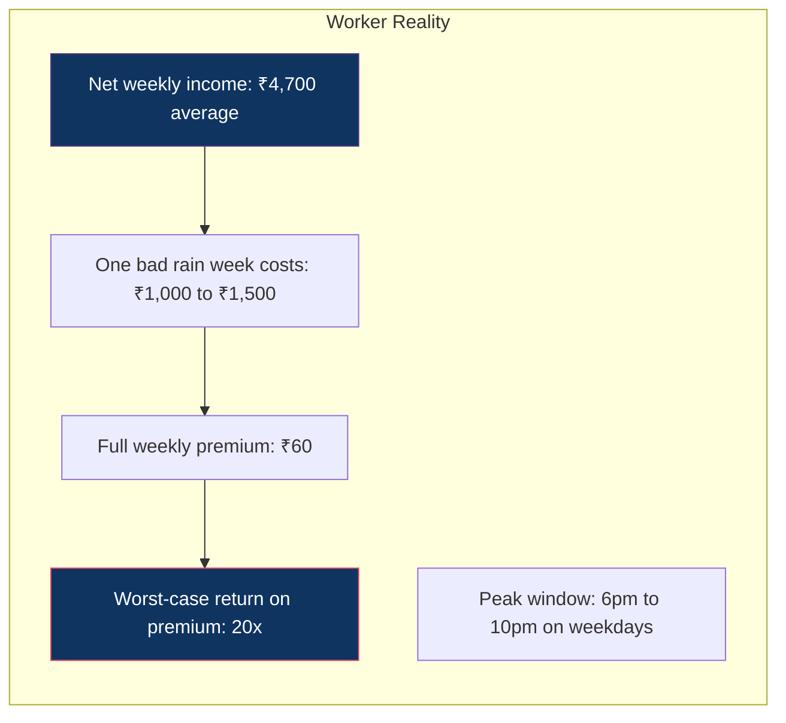

---

## weekly premium model

gig workers get paid weekly. they spend weekly. a monthly premium model creates a mismatch that kills adoption before it starts. locus is structured to match their actual financial cycle.

| component | weekly amount | what it covers |
|---|---|---|
| insurance premium | ₹40 | direct payouts for severe disruptions |
| credit reserve contribution | ₹20 | personal credit pool for moderate events |
| **total** | **₹60** | full income protection both layers |

the ₹60 base adjusts every monday based on three inputs specific to that worker.

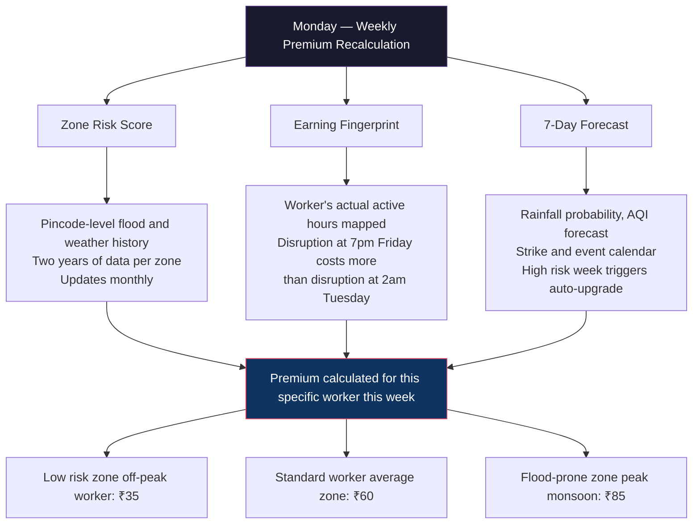

---

## parametric triggers

every trigger is monitored continuously. no human touches the claims pipeline at any point.

| trigger | threshold | response | layer |
|---|---|---|---|
| rainfall | above 15mm per hour sustained 2+ hours | credit advance ₹200–500 | 2 |
| flooding | IMD flood alert active in worker pincode | direct payout ₹500–1000 | 1 |
| air quality | AQI above 400 for 4+ hours | credit advance ₹200–500 | 2 |
| curfew | government declared any duration | direct payout ₹500–1000 | 1 |
| local strike | zone closure over 3 hours | credit advance ₹200–500 | 2 |
| compounding | two or more triggers active simultaneously | auto coverage upgrade | both |

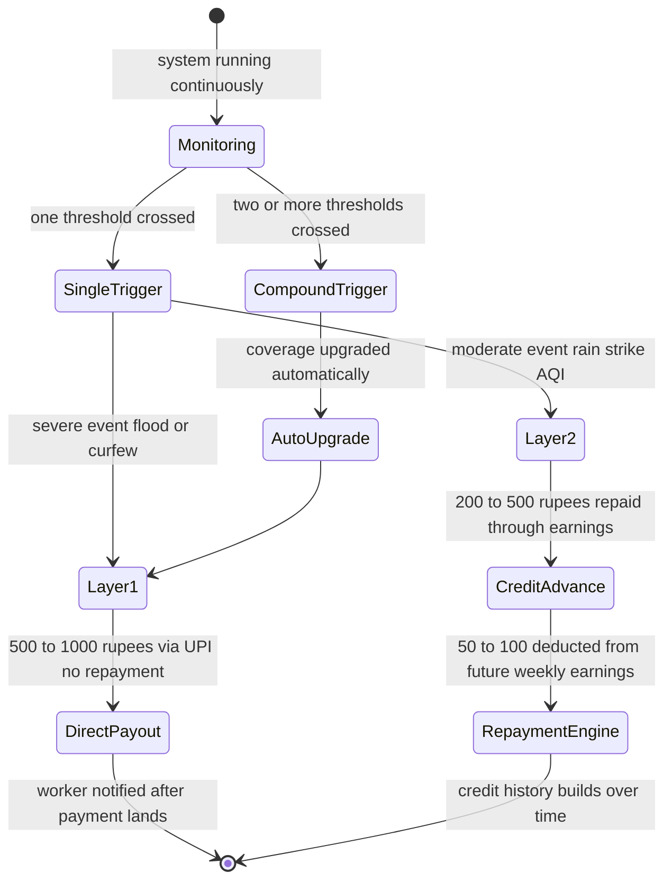

---

## the silent claims pipeline

the worker never files a claim. the system detects, validates, and pays without any input from the worker. this is the entire point.

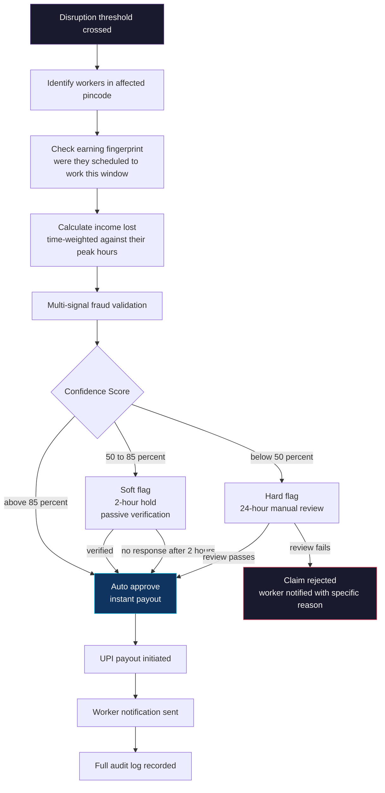

---

## AI and ML architecture

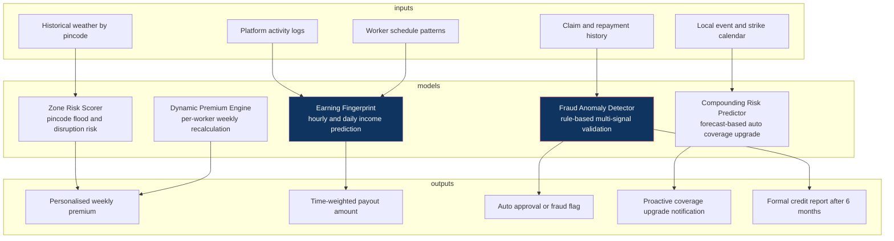

**earning fingerprint** maps each worker's active hours by day and time. a disruption hitting their thursday evening peak triggers a higher payout than the same disruption at 3am. flat-rate payouts are not how real income loss works.

**zone risk scoring** operates at pincode level not city level. a worker in velachery and a worker in adyar are in the same city but face completely different flood exposure. the model knows the difference.

**repayment intelligence** monitors earnings passively each week. strong week means automatic deduction. weak week means the repayment pauses with no penalty. after six months of clean repayment the worker has a financial identity that did not exist before they joined locus.

---

## Adversarial Defense & Anti-Spoofing Strategy

### the threat

five hundred delivery workers coordinating via telegram, running GPS spoofing apps to fake their location inside an active flood alert zone, filing claims simultaneously, and draining the liquidity pool before the system detects anything unusual.

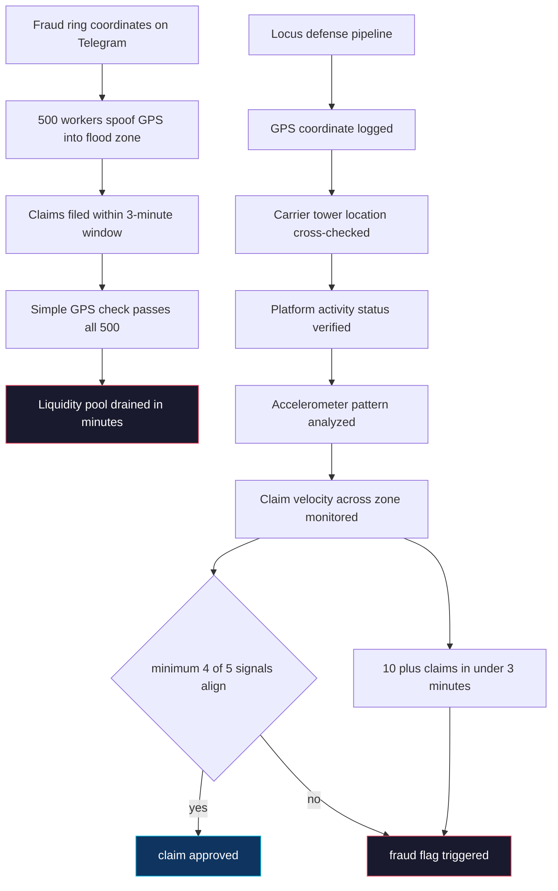

### why a single GPS check fails

a spoofed GPS coordinate looks identical to a real one. there is no way to tell them apart if GPS is the only thing being checked. locus validates every claim across five independent signal dimensions simultaneously. compromising one or two is possible. compromising all five simultaneously without producing detectable statistical patterns is not.

### layer 1 — signal triangulation

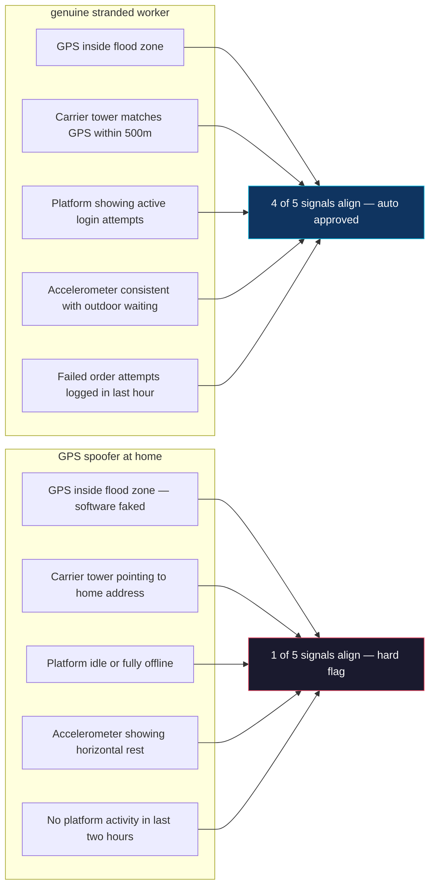

the most reliable signal is carrier tower triangulation. GPS can be overridden in software. the mobile network carrier tower that a device is physically connected to cannot be spoofed from a stationary home location. a gap of more than 500 meters between GPS coordinates and carrier tower location triggers an immediate fraud review regardless of other signals.

### layer 2 — coordinated ring detection

individual fraud gets caught by signal triangulation. coordinated ring fraud requires population-level detection.

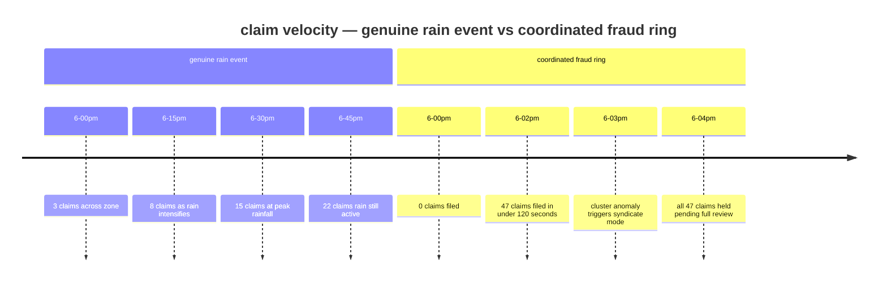

ten or more claims from the same zone within a three-minute window triggers automatic syndicate investigation. additional signals include historical baseline deviation where a worker suddenly claiming from a zone they have never worked in before gets flagged, device fingerprinting where multiple worker IDs originating from the same physical device get hard blocked, and social graph analysis where workers who consistently appear together across multiple separate claim events build a suspicion profile over time.

### layer 3 — ux balance

the goal is to stop fraud rings without creating a hostile experience for honest workers who may have imperfect signals during a genuine crisis.

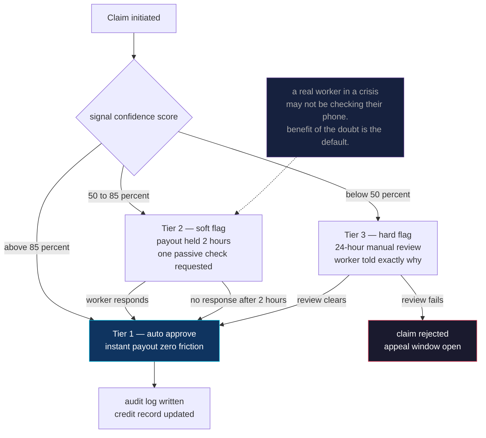

any worker with six or more months of clean history gets automatic tier 1 status permanently. friction decreases the longer someone uses the platform honestly. that is intentional.

### the false positive problem — what happens tonight

this is the hardest part of the design. a genuine worker is stranded in a flood zone on a thursday evening. their GPS is jumping because the signal is degraded by heavy rain. their carrier tower shows them 600 meters from their GPS position because they are moving between zones trying to find a dry route. the system flags them tier 3.

they need money tonight. not in 24 hours.

locus handles this with an emergency partial release mechanism. when a tier 3 flag is triggered during an active severe weather event, the system automatically releases fifty percent of the calculated payout immediately as a non-repayable advance. the remaining fifty percent is held pending the 24-hour review. if the review clears, the remainder lands. if the review fails, locus absorbs the advance as a cost of operating fairly. a real fraud ring targeting fifty percent payouts is not economically viable — the math stops working for them at half payout.

this means an honest worker never goes home empty-handed because an algorithm had incomplete signal. and a fraud ring gains nothing from triggering a flag intentionally to access partial payouts.

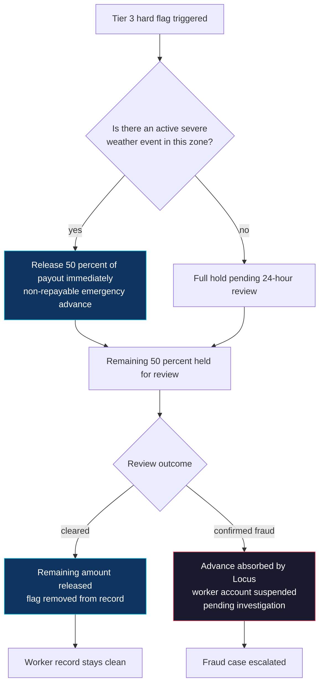

the system is designed around one principle: it is more expensive to wrongly deny a genuine claim than to absorb the occasional partial fraud loss. a stranded worker who gets nothing tonight does not come back. a fraud ring getting fifty percent of a flagged claim stops being profitable.

---

## technical architecture

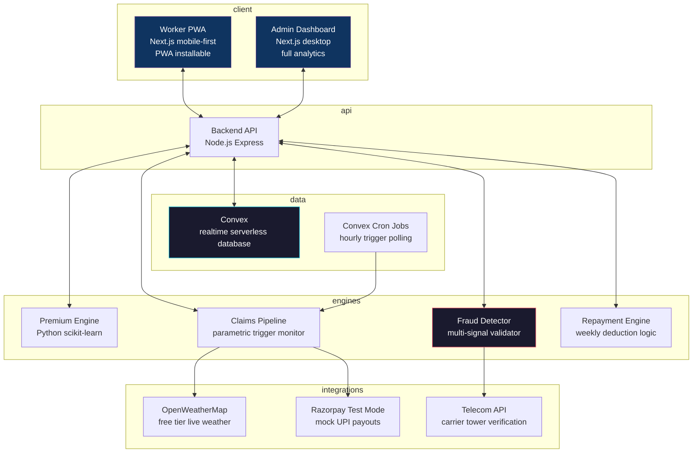

---

## stack

```mermaid
graph TD
    subgraph client [Client Layer]
        W[Worker PWA\nNext.js mobile-first]
        A[Admin Dashboard\nNext.js desktop]
    end

    subgraph backend [Backend Layer]
        API[Node.js API]
        CP[Silent Claims Pipeline]
        RE[Repayment Engine]
    end

    subgraph ai_ml [AI and ML Layer — Python + scikit-learn]
        direction LR
        subgraph inputs [Data Inputs]
            D1[Platform activity logs]
            D2[Historical weather\nper pincode]
            D3[Worker schedule\npatterns]
            D4[Claim and repayment\nhistory]
            D5[Strike and event\ncalendar]
        end

        subgraph models [Models]
            EF[Earning Fingerprint\nPredicts income loss\nby hour and day]
            ZR[Zone Risk Scorer\nPincode flood risk\n2yr historical data]
            PE[Dynamic Premium\nWeekly recalculation\nper worker]
            FD[Fraud Detector\nMulti-signal classifier\n5 independent signals]
            CR[Compounding Risk\nForecast-based\nauto coverage upgrade]
        end

        subgraph outputs [Outputs]
            O1[Personalised\nweekly premium]
            O2[Time-weighted\npayout amount]
            O3[Auto approve\nor fraud flag]
            O4[Coverage upgrade\nnotification]
            O5[Credit report\nafter 6 months]
        end

        D1 --> EF
        D2 --> ZR
        D3 --> EF
        D4 --> FD
        D5 --> CR
        EF --> O2
        ZR --> O1
        PE --> O1
        FD --> O3
        CR --> O4
        FD --> O5
    end

    subgraph data [Data Layer]
        CV[Convex Database\nrealtime + serverless\nACID transactions]
        CJ[Convex Cron Jobs\nhourly trigger polling]
    end

    subgraph integrations [External Integrations]
        OW[OpenWeatherMap\nfree tier\nlive disruption data]
        RP[Razorpay Test Mode\nmock UPI payouts]
        TM[Carrier Tower API\nanti-spoofing signal]
    end

    subgraph hosting [Hosting]
        VL[Vercel free tier\nauto deploy from GitHub]
    end

    W <--> API
    A <--> API
    API <--> ai_ml
    API <--> CP
    API <--> RE
    API <--> CV
    CJ --> CP
    CP --> OW
    CP --> RP
    FD --> TM
    W --> VL
    A --> VL

    style W fill:#0f3460,stroke:#533483,color:#fff
    style A fill:#0f3460,stroke:#533483,color:#fff
    style API fill:#0f3460,stroke:#00b4d8,color:#fff
    style CP fill:#0f3460,stroke:#00b4d8,color:#fff
    style RE fill:#0f3460,stroke:#00b4d8,color:#fff
    style EF fill:#16213e,stroke:#533483,color:#fff
    style ZR fill:#16213e,stroke:#533483,color:#fff
    style PE fill:#16213e,stroke:#533483,color:#fff
    style FD fill:#16213e,stroke:#e94560,color:#fff
    style CR fill:#16213e,stroke:#533483,color:#fff
    style CV fill:#1a1a2e,stroke:#00b4d8,color:#fff
    style CJ fill:#1a1a2e,stroke:#00b4d8,color:#fff
    style VL fill:#1a1a2e,stroke:#00b4d8,color:#fff
    style OW fill:#1a1a2e,stroke:#533483,color:#fff
    style RP fill:#1a1a2e,stroke:#533483,color:#fff
    style TM fill:#1a1a2e,stroke:#e94560,color:#fff
```

| layer | technology | reason |
|---|---|---|
| frontend | next.js + tailwind | one codebase, mobile worker PWA and desktop admin dashboard |
| ai and ml | python + scikit-learn | earning fingerprint, zone risk scoring, premium engine, fraud detection |
| backend | node.js | api layer, claims pipeline, repayment engine |
| database | convex | realtime, serverless, ACID, cron jobs built in — no separate server |
| weather | openweathermap free tier | live disruption trigger monitoring |
| payments | razorpay test mode | mock UPI payouts |
| hosting | vercel free tier | zero cost, auto deploys from github |

total infrastructure cost: zero.

---

## development roadmap

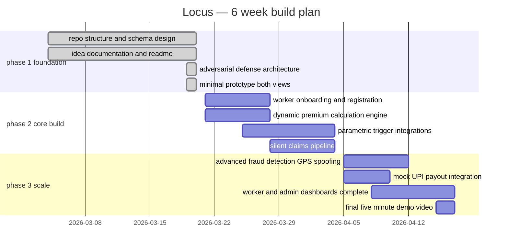

---

## team

| member | focus | what they own |
|---|---|---|
| member a | backend | api layer, database schema, parametric trigger engine, end-to-end pipeline integration |
| member b | ai and ml | earning fingerprint model, zone risk scorer, dynamic premium engine, fraud anomaly detection |
| member c | frontend | worker-facing PWA — registration, policy view, payout notification screens |
| member d | systems and ops | admin dashboard, mock API responses, testing, pitch deck, submission logistics |

---

## why the numbers work

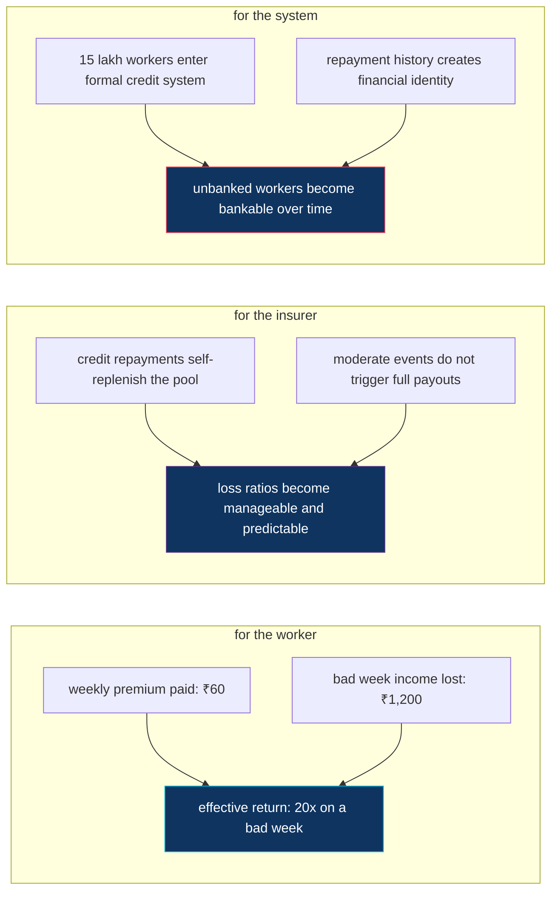

pure parametric insurance at this scale breaks down during monsoon season because everyone claims at once. the credit layer solves this. repayments create a float that stabilises the pool. the insurer's loss ratio stays predictable. the worker gets protected. the credit facility is not just a product feature — it is what makes the business model viable.

the safety net exists. it just has not been built yet.

---

*locus — guidewire devtrails 2026*
